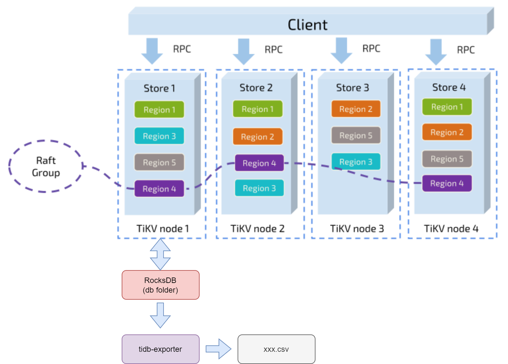

# tidb-exporter

[简体中文](README_zh.md)

TiDB uses RocksDB as default storage engine(in fact, TiKV uses it). `tidb-exporter` can export data from pure RocksDB data files even when TiDB server is not running. This is very useful for exporting data in cases where TiDB is shut down for some reason and recovery is difficult.

**Make sure TiDB or TiKV server is not running before using this tool.**



# List Databases

Specifing only the '`-p`' parameter will list all the databases on one of the TiKV nodes.

```bash
./tidb-exporter -p /data/tikv/db
```
```
1, test
10216, user
11455, xxl_job
11506, product
11558, task
```

The first column represents the inner sequence number of the databases, which is generated within TiDB. The second column contains the database name. 

# List Tables

In addition to the '`-p`' parameter, you have also set '`-d`', which will list all database tables of the specified database.

```bash
./tidb-exporter -p /data/tikv/db -d user
```
```
8980, user_avatar
11906, user_detail
```

# Export Data

When Specifying the '`-t`' parameter to export data from a specified table, you should also specify the '-e' parameter to indicate which `Exporter` you want to use, although currently, only `csv` is available. Finally, use the '`-w`' to indicate the location to which the `Exporter` will write.

```bash
./tidb-exporter -p /data/tikv/db -d user -t user_avatar -e csv -w ~/user.csv
```

tidb-exporter exports all the data that has been stored in RocksDB, which means it will export regions even if they are not leaders in this TiKV node. If you have a cluster with three nodes, it will theoretically export all the data in the database.